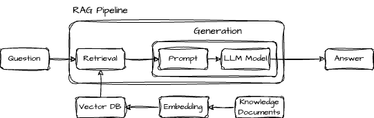
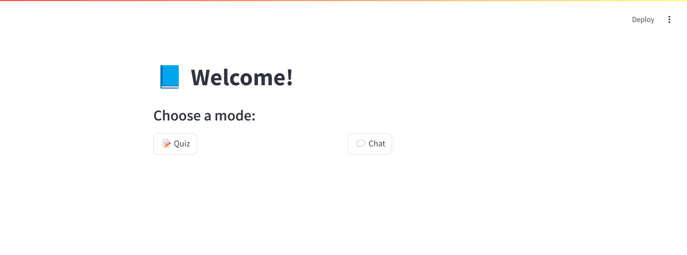
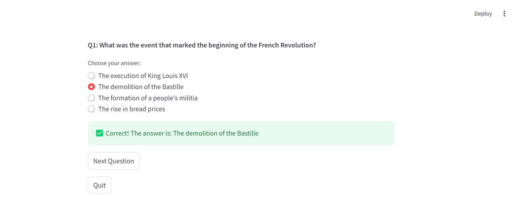
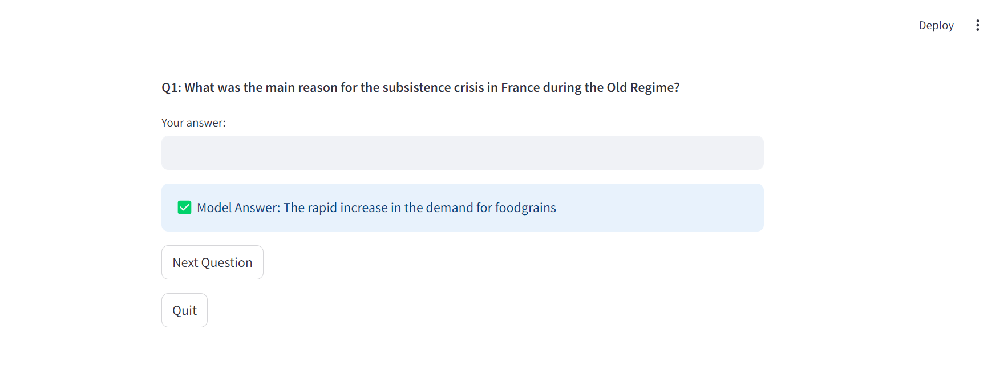
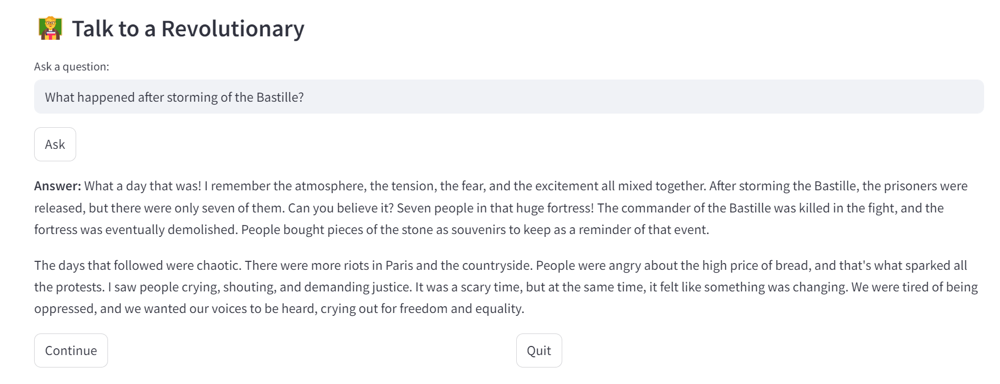
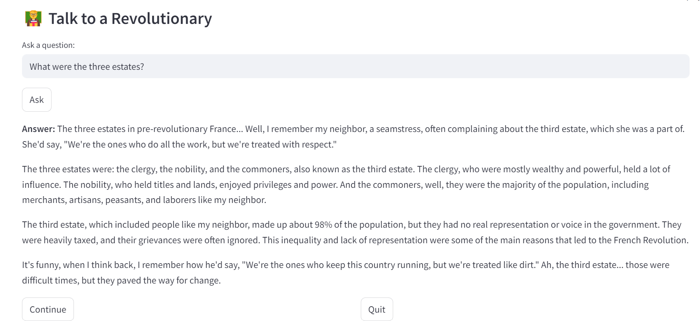

📚 **GenAI-Powered Study Aid: RAG-Based Quiz & Chatbot**

This project is a practical learning journey into **Retrieval-Augmented Generation (RAG)**, using quiz generation and a persona-based chatbot to practically demonstrate how modern GenAI techniques can enhance comprehension and contextual response generation using custom study material.

It combines **LangChain, Groq-hosted Llama3-70B (llama3-70b-8192), Chroma Vector DB**, and a **conversational agent persona** to provide a richer learning experience.

🚀 Features

📖 Load and process study material from PDFs

🧠 Embed content using **sentence-transformers/all-MiniLM-L6-v2** from **HuggingFaceEmbeddings**

📊 Generate quizzes (MCQs and short answers) from content

🗣️ Chatbot answers questions in the tone and persona of a historical figure

✅ Reduces hallucinations by grounding LLMs in actual study content

🧠 How It Works
1. Understanding the Problem

Generic LLMs often lack specific domain knowledge and may hallucinate answers. Retrieval-Augmented Generation (RAG) addresses this by combining:

- A **retriever**: fetches relevant information

- A **generator (LLM)**: answers questions using that info

2. Loading & Chunking the PDF

PDFs are parsed using PyPDF2

Content is split into **chunks** using **RecursiveCharacterTextSplitter**

chunk_size = 6000, chunk_overlap = 600

Helps maintain context while respecting token limits

3. Embedding and Storing

Chunks are converted to **vector embeddings** using **sentence-transformers/all-MiniLM-L6-v2**

Stored in **Chroma VectorDB** for fast semantic search

4. Quiz Generation

LangChain's **load_summarize_chain** with **chain_type = 'stuff'**

Iterates through chunks and uses a custom prompt to generate:

- Multiple-choice questions (MCQs)
- Short-answer questions

The LLM used: **llama3-70b-8192** via **Groq**

5. Conversational Agent

Uses LangChain's **ConversationalRetrievalChain** for persona-based chat responses.

Prompt defines the tone and character (e.g., a history teacher or a figure from the text)

Memory stores last 4 turns for context

Answers are generated using relevant content retrieved from the vector DB

